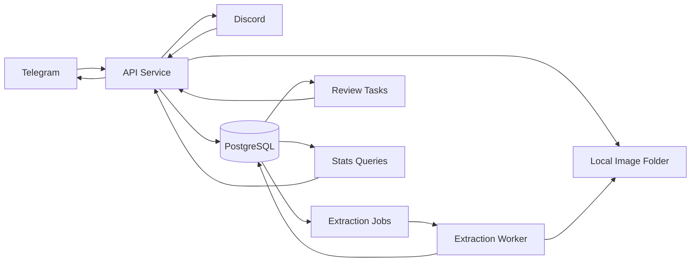

# CStats Solution Architecture

## Purpose

CStats collects Counter-Strike 2 match-result images from chat channels, extracts scoreboard statistics, resolves player nicknames to canonical users, stores committed matches idempotently, and answers aggregate-stat commands such as `/top10`, `/mvp`, and `/stats`.

The project is kept in one repository as a small monorepo. Each deployable service has its own folder and service-level architecture document.

## Repository Layout

```text
solution/
  ARCHITECTURE.md
  services/
    api/
      ARCHITECTURE.md
    extraction-worker/
      ARCHITECTURE.md
    database/
      ARCHITECTURE.md
```

Future code can live in the same folders:

```text
solution/
  services/
    api/
      src/
    extraction-worker/
      src/
    database/
      migrations/
      seeds/
  fixtures/
    cs2-scoreboards/
  infra/
    docker-compose.yml
```

## Services

### API Service

The API service owns all chat-facing behavior:

- Telegram and Discord adapters
- image ingestion
- local-disk image persistence
- command handling
- same-channel admin review prompts
- match commit workflow after identity resolution

This service should not perform heavy image parsing itself. It creates extraction jobs in PostgreSQL and responds to parser results.

### Extraction Worker

The extraction worker owns image parsing:

- claims jobs from PostgreSQL
- loads image files from disk
- detects and crops the CS2 scoreboard panel
- performs OCR and structured parsing
- writes raw OCR, normalized payloads, confidence scores, and fingerprints back to PostgreSQL

It should be lightweight, Docker-friendly, and free of Telegram or Discord dependencies.

### Database Service

The database service is not an app process, but it has enough responsibility to deserve its own folder:

- PostgreSQL schema and migrations
- PostgreSQL-backed job queue
- idempotency constraints
- canonical player and alias model
- committed match/stat tables
- review task tables

PostgreSQL is the coordination point between the API service and the extraction worker.

## High-Level Flow



## Key Decisions

- Use one repository with service folders, not git submodules.
- Store original and derived images on local disk only.
- Use PostgreSQL for durable storage and async jobs.
- Keep the extraction worker stateless except for PostgreSQL and the mounted image folder.
- Ask clarification questions in the same channel where the image was uploaded.
- Treat platform message ids as transport idempotency only.
- Treat normalized match fingerprints as the final source-independent match idempotency key.
- Link duplicate uploads as match evidence instead of creating duplicate matches.

## Idempotency

Idempotency has multiple layers:

- source message key: `(platform, channel_id, message_id)` for webhook retry safety
- image `sha256` for exact duplicate files
- perceptual image hash for near-duplicate monitor photos
- normalized match fingerprint for final committed-match uniqueness

The match fingerprint must not include platform, adapter type, chat id, message id, sender id, or local file path.

## Image Parsing Assumptions

Initial fixtures are Telegram JPEG photos of a monitor, not clean screenshots. The parser must handle:

- perspective skew
- glare and uneven brightness
- screen moire
- Russian CS2 UI labels
- repeated photos of the same scoreboard
- irrelevant rank/progress UI around the scoreboard

The first parser milestone should use the provided sample images as fixtures and prove that duplicate photo groups collapse to a single match after extraction.

## First Milestone

1. API service receives Telegram image messages.
2. API stores images on disk and creates PostgreSQL jobs.
3. Extraction worker parses fixture images or accepts a parser stub result.
4. API creates same-channel review prompts for unknown nicknames or low-confidence fields.
5. Admin resolves unknown users as new, skipped, or merged aliases.
6. Match is committed once identity and required fields are resolved.
7. `/top10` and `/stats <nickname>` read from committed matches only.
